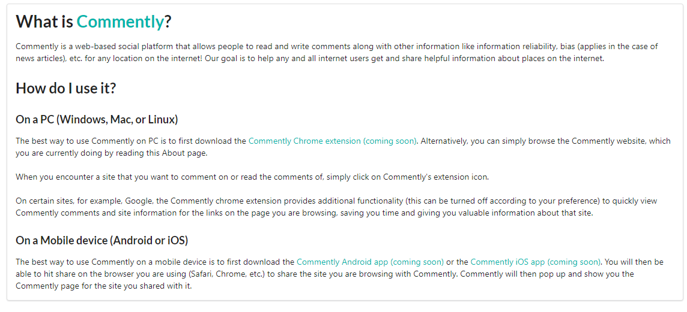

# Commently Web App

Commently is a web-based social platform that allows people to read and write comments along with other information like information reliability, bias (applies in the case of news articles), etc. for any location on the internet! Our goal is to help any and all internet users get and share helpful information about places on the internet.

This repository houses the React 17-based frontend for Commently (https://commently.net).

# Technologies Used

🔥 `Firebase Auth`, `Firebase Cloud Functions`, `Firebase Hosting`

🌐 `React.JS`, `React Router`, `TypeScript`